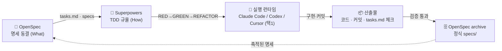
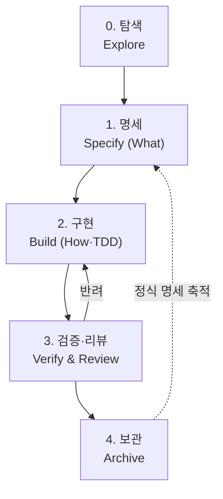
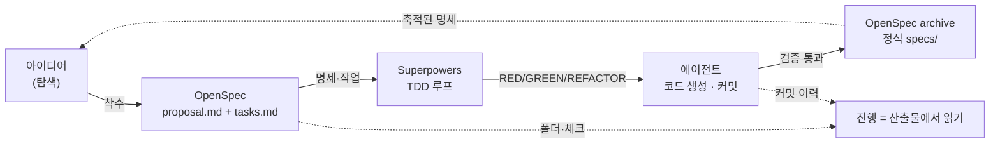

# Agentic Coding Workflow

> [!abstract] 한 줄 요약
> **OpenSpec**로 *무엇을* 고정하고, **Superpowers**의 TDD 규율로 *어떻게*를 구현한다. **Claude Code / Codex / Cursor**는 셋 중 하나를 골라 쓰는 실행 런타임이다. "지금 어디까지 왔나"는 따로 관리하는 상황판이 아니라 **산출물(OpenSpec 폴더 · `tasks.md` · 커밋 이력)에서 그대로 읽는다.**

---

## 1. 목적과 철학

에이전트가 코드를 쓰는 시대의 핵심 문제는 "에이전트가 코드를 못 쓰는 것"이 아니라 **의도(intent)와 공정(process)이 흩어져 사람이 통제권을 잃는 것**이다. 에이전트는 빠르지만 맥락을 잊어, 세션이 끊기면(다른 날, 컨텍스트 리셋, 사람 교대) "무엇을 만들기로 했지", "지금 어디까지 됐지"가 증발한다.

이 워크플로우의 목표는 단 하나다.

> **에이전트는 산출물(artifact)을 통해서만 협업하고, 사람은 그 산출물에서 진행을 읽는다.**

그래서 두 가지를 **물리적으로 분리**한다.

| 축 | 질문 | 담당 | 산출물 형태 |
|---|---|---|---|
| **What (무엇을)** | 무엇을 만들 것인가 | OpenSpec | 동결된 명세 · 제안서 · 작업목록 |
| **How (어떻게)** | 어떻게 만들 것인가 | Superpowers | TDD(RED→GREEN→REFACTOR) 커밋 이력 |

"지금 어디까지 왔나"는 **세 번째 축이 아니다.** 그것은 위 두 축의 산출물에서 *유도되는 읽기*다 — OpenSpec change 폴더의 위치(`changes/` ↔ `archive/`), `tasks.md`의 체크 상태, 커밋 이력. 별도의 상황판을 두지 않는다. 상황판을 두는 순간 그것이 산출물과 어긋나고, 사람은 둘 중 무엇이 진실인지 다시 헷갈린다.

> [!danger] 불가침 전제 — 스펙 = SOT (Single Source of Truth)
> **OpenSpec의 동결된 명세가 "무엇을"의 유일한 진실원이다.** 코드·테스트·사람의 기억이 명세와 어긋나면 **언제나 명세가 이긴다** — 나머지를 명세에 맞춘다. 명세가 틀렸다면 코드가 아니라 **명세를 먼저 고친다**(§3 단계 1로 복귀). 이 전제가 깨지면 아래 원칙들은 의미를 잃는다.
>
> *SOT는 스펙 하나다.* 진행 상태(어디까지 왔나)는 별도의 진실원이 아니라 스펙이 정의한 작업의 *실행 사실*이며, 산출물(OpenSpec 폴더 · `tasks.md` · 커밋 이력)에 그대로 남는다. 사람이 따로 옮겨 적는 진행판은 없다 — 옮겨 적는 순간 표류(drift)가 시작되기 때문이다.

핵심 원칙:

1. **명세는 계약이다.** 합의된 명세는 동결한다. 구현 중에 "무엇을"이 흔들리면 코드가 아니라 명세를 먼저 고친다.
2. **공정은 강제된다.** 구현은 항상 실패하는 테스트(RED)에서 시작한다. 테스트 없는 코드는 워크플로우 위반이다.
3. **진행 상태는 산출물에서 읽는다.** "어디까지 왔나"의 진실은 스펙이 정의한 작업의 *실행 사실*이며, OpenSpec 폴더 위치 · `tasks.md` 체크 · 커밋 이력에 남는다. 이를 베껴 둔 별도의 진행판을 만들지 않는다.
4. **에이전트는 하나를 고르되 종속되지 않는다.** Claude Code·Codex·Cursor 중 하나를 표준 런타임으로 쓴다. 입·출력 인터페이스(명세, 작업목록, 테스트)가 산출물로 고정돼 있어, 나중에 다른 것으로 갈아타도 손실이 없다 — 다만 일상적으로 여러 개를 병행하지는 않는다. 산출물이 메모리다.

---

## 2. 역할 매핑



| 도구 | 역할(별칭) | 책임 | 책임 아님 |
|---|---|---|---|
| **OpenSpec** | 계약(Contract) | 변경 제안, 명세 동결, 작업 분해, 보관(archive) | 구현 방법 |
| **Superpowers** | 공정(Process) | TDD 규율, 브레인스토밍→계획→구현, 검증 | 무엇을 만들지 결정 |
| **Claude Code / Codex / Cursor** | 작업자(Worker) | 명세·작업목록·테스트를 받아 실제 코드 생성 | 명세의 정본 보관 |
| **버전 관리 (git)** | 이력(History) | RED→GREEN→REFACTOR 커밋, 변경 이력 | 사람용 진행 요약 — 그건 산출물에서 읽는다 |

---

## 3. 전체 워크플로우 (Lifecycle)



각 단계를 **입력 / 행위자 / 도구 / 산출물 / 진행 표시 / 통과 게이트**로 정의한다. 진행 표시는 사람이 끄는 상태값이 아니라 **산출물의 사실**(폴더 위치·체크·커밋)이다.

> [!note] 단계 트리거 — `/opsx:*` 슬래시 커맨드
> 각 단계는 OpenSpec이 깔아 주는 슬래시 커맨드(`/opsx:explore` · `propose` · `apply` · `verify` · `archive`)로 트리거한다. 아래 표기는 Claude Code 기준이며, **Codex·Cursor에서는 `/opsx-*`**로 불린다. 런타임별 트리거 표·설치 방법은 온보딩 문서([`Agentic-Workflow-Onboarding.md`](Agentic-Workflow-Onboarding.md))를 참조.

### 단계 0 — 탐색 (Explore)

| 항목 | 내용 |
|---|---|
| 입력 | 막연한 아이디어·문제·요구 |
| 행위자 | 사람 + 에이전트(소크라테스식 문답) |
| 도구 | OpenSpec `/opsx:explore` / Superpowers 브레인스토밍 |
| 산출물 | 정리된 문제 정의, 후보 접근법, 미해결 질문(결정 노트) |
| 진행 표시 | 아직 change 폴더 없음 |
| 게이트 → 1 | "무엇을 만들지" 한 문장으로 말할 수 있다 |

> 목적은 **수렴**이다. 코드를 한 줄도 쓰지 않는다. 결론은 결정 노트로 남기고, 합의되면 명세화로 넘어간다.

### 단계 1 — 명세 (Specify / What) · OpenSpec

| 항목 | 내용 |
|---|---|
| 입력 | 탐색 결론 |
| 행위자 | 에이전트 작성 → **사람 검토·동결** |
| 도구 | OpenSpec `/opsx:propose` |
| 산출물 | `openspec/changes/{slug}/` 하위에 `proposal.md`, `specs/`(요구사항은 **EARS**로 작성 → §8.1), `tasks.md`, (필요시 `design.md`) |
| 진행 표시 | `openspec/changes/{slug}/` 생성됨, 아직 구현 커밋 없음 |
| 게이트 → 2 | 사람이 명세를 읽고 **동결(freeze)**에 서명. 요구사항이 **EARS**로 쓰여 있고, `tasks.md`가 검증 가능한 단위로 쪼개져 있다 |

> [!tip] specs는 EARS로 쓴다
> `specs/`의 각 요구사항은 **EARS** 패턴(WHEN/WHILE/IF·THEN/WHERE + "~해야 한다")으로 적는다. 한 요구사항이 곧 하나의 검증 단위 → `tasks.md` 한 줄 → 하나의 RED 테스트로 내려간다. 패턴·예시는 §8.1.

> [!important] 동결의 의미
> 이 시점 이후 "무엇을"이 바뀌면 코드를 손대기 전에 **명세를 먼저 개정**한다(새 change 또는 현 change 갱신). 구현 도중의 슬그머니 스코프 변경(scope creep)을 명세 변경 이벤트로 강제 승격시키는 것이 이 워크플로우의 핵심 안전장치다.

### 단계 2 — 구현 (Build / How) · Superpowers + 에이전트

| 항목 | 내용 |
|---|---|
| 입력 | `tasks.md`의 한 작업 단위 |
| 행위자 | 에이전트(Claude Code/Codex/Cursor 중 택1) + Superpowers 규율 |
| 도구 | OpenSpec `/opsx:apply` + Superpowers TDD 루프 |
| 산출물 | 작업당: 실패 테스트(RED) → 최소 구현(GREEN) → 리팩터(REFACTOR) 커밋, `tasks.md` 체크 갱신 |
| 진행 표시 | `tasks.md` 체크 수 / 커밋 이력 |
| 게이트 → 3 | 해당 change의 모든 task 체크 완료, 로컬 테스트 전부 green |

루프 규칙(어떤 에이전트든 동일):

```
for task in tasks.md:
    1) RED     — task를 표현하는 실패하는 테스트를 먼저 쓴다
    2) GREEN   — 테스트를 통과시키는 최소 코드만 쓴다
    3) REFACTOR— green을 유지하며 정리한다
    4) tasks.md의 해당 항목을 [x]로, 핸드오프 노트에 1줄 기록
```

> [!warning] 세션 핸드오프
> 세션을 마치거나 끊을 때는 **반드시 핸드오프 노트("다음 할 일 1줄 + 마지막 green 커밋 해시")**를 남긴다 — change 폴더의 `notes.md`(또는 커밋 메시지)에. 다음 세션은 명세(What)·작업목록·테스트(How)·핸드오프 노트(Where)만 보고 이어받는다. 사람 머릿속 컨텍스트에 의존하지 않는다.

### 단계 3 — 검증·리뷰 (Verify & Review)

| 항목 | 내용 |
|---|---|
| 입력 | 구현 완료된 변경 |
| 행위자 | 로컬 테스트 + 에이전트 셀프리뷰 + 사람 |
| 도구 | OpenSpec `/opsx:verify`(완전성·정확성·일관성) + 테스트 러너 · 코드 리뷰(로컬 diff / 팀 리뷰 도구) |
| 산출물 | 테스트 결과(전부 green), 리뷰 코멘트, 필요 시 결정 노트 |
| 진행 표시 | 테스트 green + 리뷰 승인 |
| 게이트 → 4 | 테스트 green, 리뷰 승인, 구현이 **동결된 명세와 일치**함을 확인 |
| 반려 시 | 단계 2로 되돌리고 결정 노트에 사유 기록 |

> 리뷰의 기준선은 취향이 아니라 **명세**다. "이게 좋다/나쁘다"가 아니라 "명세대로인가"를 먼저 본다. 명세가 틀렸다면 그건 코드 반려가 아니라 **명세 개정**(단계 1로 복귀)이다.

### 단계 4 — 보관 (Archive) · OpenSpec

| 항목 | 내용 |
|---|---|
| 입력 | 검증 통과한 변경 |
| 행위자 | 에이전트 실행 + 사람 확인 |
| 도구 | OpenSpec `/opsx:archive` |
| 산출물 | change의 델타 명세가 정식 `openspec/specs/`로 승격, change 폴더가 `changes/archive/`로 이동 |
| 진행 표시 | change 폴더가 `openspec/changes/archive/`에 있음 = 완료 |
| 후속 | 정식 명세가 누적되어 다음 탐색·명세의 토대가 된다(점선 피드백) |

---

## 4. 정보 흐름 (산출물이 곧 인터페이스)



사람이 "지금 어디까지"를 물으면, 답은 **새로 관리하는 보드가 아니라 산출물 그 자체**다: change 폴더가 `changes/`에 있으면 진행 중, `archive/`에 있으면 완료, `tasks.md`의 체크 비율이 곧 진행률, 커밋 이력이 곧 *어떻게 왔는지*다. 점선(`F`)은 그 읽기를 표시할 뿐 — 따로 *저장*되는 상태가 아니다.

| 산출물 | 생산자 | 소비자 | 의미 |
|---|---|---|---|
| `proposal.md` / `specs/` | OpenSpec | 사람, 에이전트 | "무엇을"의 동결된 정본(SOT) |
| `tasks.md` | OpenSpec | 에이전트 | 작업의 단위이자 진행률의 원천 |
| 테스트 코드 | Superpowers/에이전트 | 테스트 러너, 다음 세션 | "어떻게"의 실행 가능한 명세 |
| 커밋 이력 | 에이전트 | 다음 세션, 리뷰 | RED→GREEN→REFACTOR의 사실 기록 |
| 핸드오프 노트 | 작업한 세션 | 다음 세션 | 핸드오프 컨텍스트 |
| 결정 노트 | 결정한 사람/세션 | 미래의 모두 | 코드에 안 남는 *왜* |

---

## 5. 진행 상태 읽기 (상황판 없이)

별도의 상황판을 두지 않기로 했으니(§1), "지금 어디까지"는 **산출물을 질의**해서 답한다. 사람이 옮겨 적는 단계가 없으므로 표류(drift)도 없다.

| 묻는 것 | 어디서 읽나 |
|---|---|
| 진행 중인 변경은 무엇인가 | `openspec/changes/`의 (archive 아닌) 폴더 목록 — `openspec list` |
| 그 변경은 얼마나 됐나 | 해당 `tasks.md`의 `[x]` 비율 |
| 어떻게 여기까지 왔나 | 그 change의 커밋 이력 |
| 다음 할 일은 무엇인가 | `tasks.md`의 첫 미체크 항목 + 핸드오프 노트 |
| 무엇이 끝났나 | `openspec/changes/archive/`의 폴더 |
| 왜 이렇게 결정했나 | 그 change의 결정 노트 |

> [!note] 자동화가 필요 없다는 뜻은 아니다
> 원한다면 이 질의들을 묶는 얇은 스크립트(예: `make status`가 `openspec list` + 각 `tasks.md` 체크 비율을 출력)를 둘 수 있다. 그러나 그것은 **상황판이 아니라 산출물을 읽어 주는 뷰**일 뿐이다 — 상태를 *저장*하지 않으므로 어긋날 것이 없다. "유도할 수 있으면 읽고, 저장하지 않는다"가 원칙이다.

---

## 6. 실행 런타임 선택 (Claude Code / Codex / Cursor)

세 에이전트는 **같은 일을 하는 후보**다 — 셋 중 **하나를 골라** 이 워크플로우의 표준 실행 런타임으로 쓴다. 무엇을 고르든 입·출력 인터페이스가 같아 워크플로우는 동일하게 성립한다.

1. **인터페이스 고정**: 입력은 항상 `(동결된 명세 + tasks.md + 기존 테스트 + 핸드오프 노트)`, 출력은 항상 `(RED→GREEN→REFACTOR 커밋 + tasks 체크 + 핸드오프 노트 1줄)`. 어떤 런타임을 고르든 이 인터페이스는 같다.
2. **하나를 표준으로 고정**: 일상 작업은 선택한 런타임 하나로 한다. 여러 개를 동시에 오가지 않는다 — 오가는 순간 "지금 어디까지"가 산출물이 아니라 사람 머릿속에만 남는다.
3. **선택은 작업 성격에 맞게 한 번**(예시 가이드, 강제 아님):
   - 명세 작성·대규모 리팩터·다단계 추론 → 긴 맥락에 강한 런타임
   - IDE 안에서 좁은 범위 수정 위주 → 에디터 통합 런타임
   - 반복적 코드 생성 위주 → 손에 익은 것
4. **종속되지 않는다(no lock-in)**: 인터페이스가 산출물로 고정돼 있어 나중에 다른 런타임으로 **갈아타도 손실이 없다.** 단 이는 "필요하면 교체할 수 있다"는 뜻이지 "여러 개를 병행한다"는 뜻이 아니다. 산출물에 없는 정보는 **존재하지 않는 것**으로 간주하고 핸드오프 노트에 적어 영속화한다.

---

## 7. 거버넌스 / 가드레일

> [!danger] 위반하면 멈춘다
> - **스펙이 SOT — 충돌 시 명세가 이긴다** — 코드·테스트·기억이 명세와 다르면 명세에 맞춘다. 명세가 틀렸으면 코드 말고 명세를 먼저 고친다(§3 단계 1).
> - **명세 없는 코드 금지** — `tasks.md`에 없는 작업은 하지 않는다. 필요하면 단계 1로.
> - **요구사항은 EARS로** — `specs/`의 요구사항은 EARS 패턴으로 쓴다(§8.1). "빠르게"·"사용자 친화적" 같은 모호어는 측정 가능한 기준으로 바꾼다.
> - **테스트 없는 구현 금지** — 모든 코드는 RED에서 시작한다.
> - **동결 명세의 조용한 변경 금지** — 스코프가 바뀌면 명세 변경 이벤트로 승격.
> - **별도 상황판 금지** — 진행 상태를 베껴 둔 진행판을 만들지 않는다. "어디까지"는 언제나 산출물(폴더·`tasks.md`·커밋)에서 읽는다(§5).
> - **상태 미반영 금지** — 작업했으면 `tasks.md`·핸드오프 노트를 갱신한다. 갱신 안 된 진행은 진행이 아니다.
> - **결정의 *왜* 보존** — 비자명한 선택은 결정 노트 한 개.

---

## 8. 템플릿 모음

이 절은 명세를 쓰는 **규약 하나(EARS)**와 사람이 남기는 **노트 둘(결정·핸드오프)**, 그리고 진행 질의를 모은다. 노트는 해당 change 폴더(`openspec/changes/{slug}/notes.md`)에 두어 명세·코드와 함께 archive된다.

### 8.1 EARS 요구사항 패턴 (specs 작성용)

`specs/`의 각 요구사항은 **EARS(Easy Approach to Requirements Syntax)**로 쓴다. 자연어의 모호함(누가·언제·무슨 조건에서)을 줄여, 요구사항을 **하나의 검증 단위**로 — 나아가 하나의 RED 테스트로 — 곧장 옮길 수 있게 한다. 다섯 패턴 + 조합 하나면 충분하다.

| 패턴 | 형식 | 언제 쓰나 |
|---|---|---|
| **Ubiquitous (상시)** | `<시스템>은 <응답>해야 한다.` | 트리거 없이 항상 성립하는 불변 요구 |
| **Event (이벤트)** | `WHEN <트리거>, <시스템>은 <응답>해야 한다.` | 특정 사건이 발생했을 때 |
| **State (상태)** | `WHILE <상태>, <시스템>은 <응답>해야 한다.` | 특정 상태가 지속되는 동안 |
| **Unwanted (예외/오류)** | `IF <원치 않는 조건>, THEN <시스템>은 <응답>해야 한다.` | 오류·예외·잘못된 입력 처리 |
| **Optional (선택 기능)** | `WHERE <기능이 포함된 경우>, <시스템>은 <응답>해야 한다.` | 특정 구성/기능이 있을 때만 |
| **Complex (조합)** | `WHILE <상태>, WHEN <트리거>, <시스템>은 <응답>해야 한다.` | 위 절을 결합 |

예시 (마감일 기능):

```
- (Ubiquitous) 시스템은 모든 할 일 항목에 대해 선택적 마감일 필드를 저장해야 한다.
- (Event)      WHEN 사용자가 마감일을 입력하면, 시스템은 값을 ISO-8601로 정규화해 저장해야 한다.
- (State)      WHILE 항목의 마감일이 현재보다 과거인 동안, 시스템은 항목을 '지남(overdue)'으로 표시해야 한다.
- (Unwanted)   IF 입력한 날짜 형식이 유효하지 않으면, THEN 시스템은 저장을 거부하고 형식 오류를 알려야 한다.
- (Optional)   WHERE 알림 기능이 켜져 있으면, 시스템은 마감 24시간 전에 알림을 보내야 한다.
- (Complex)    WHILE 항목이 미완료인 동안, WHEN 마감일이 지나면, 시스템은 항목을 목록 상단으로 정렬해야 한다.
```

작성 규칙:
- **한 요구사항 = 한 문장 = 하나의 검증 단위.** 그대로 `tasks.md`의 한 줄, 그리고 하나의 RED 테스트가 된다.
- 주어는 항상 **시스템**(또는 구체 컴포넌트), 서술은 **"~해야 한다"(shall)**로 통일한다.
- 키워드(WHEN/WHILE/IF·THEN/WHERE)는 **대문자**로 남겨 패턴이 한눈에 보이게 한다.
- **모호어 금지** — "빠르게"·"직관적으로"는 측정 가능한 기준(시간·횟수·상태)으로 바꾼다.

### 8.2 결정 노트 (Decision)

```
[Decision] 세션 토큰 전략
- 맥락:   무엇을 정해야 했나
- 선택지: A … / B …
- 결정·근거: B를 택함, 이유 …
- 영향:   바뀌는 것 / 되돌리는 비용
```

### 8.3 핸드오프 노트 (Session)

```
[Handoff] 2026-06-18 · codex
- 한 일:   task 3까지 완료 (RED→GREEN→REFACTOR)
- 마지막 green 커밋: a1b2c3d
- 다음:    task 4 비밀번호 해시 — 기존 테스트 auth_test.py::test_hash 확장부터
- 막힌 점: 없음
```

### 8.4 진행 질의 (상황판 대체)

별도 보드 대신, 진행은 산출물 질의로 답한다(§5):

```
openspec list                          # 진행 중 / 보관된 change
cat openspec/changes/<slug>/tasks.md   # 체크 비율 = 진행률
git log --oneline <범위>               # 어떻게 왔는지
```

---

## 9. 빠른 시작 체크리스트

**기본 셋업**
- [ ] OpenSpec 도입 — `openspec/` 구조(`changes/`, `specs/`, `changes/archive/`)
- [ ] **명세 작성 규약 합의 — 요구사항은 EARS로**(§8.1)
- [ ] Superpowers TDD 규율 채택 — 모든 구현은 RED에서 시작
- [ ] 실행 런타임 **하나** 선택(§6) — Claude Code / Codex / Cursor 중 택1
- [ ] 노트 위치 합의 — change 폴더의 `notes.md`(결정·핸드오프)

**진행 읽기 셋업 (§5, 선택)**
- [ ] `make status`(또는 유사 스크립트)로 `openspec list` + `tasks.md` 체크 비율을 출력 — 상태를 저장하지 않는 읽기 전용 뷰

**첫 한 바퀴**
- [ ] 첫 아이디어를 단계 0(탐색)으로 시작 → `/opsx:propose`로 명세 동결(요구사항은 EARS로)
- [ ] 사람이 명세를 읽고 **동결 서명**
- [ ] Superpowers TDD로 첫 task 구현(RED→GREEN→REFACTOR), 핸드오프 노트 1줄
- [ ] 테스트 green + 리뷰 → 명세와 일치 확인 → `/opsx:archive`로 정식 specs 승격

---

> [!quote] 이 워크플로우가 지키려는 한 가지
> 사람이 코드를 일일이 읽지 않고도 **"무엇을 만들기로 했고(What), 어떻게 만들어지고 있는지(How)"**를 30초 안에 답할 수 있게 한다. "지금 어디까지 왔나"는 따로 묻지 않는다 — 산출물이 곧 답이다.
