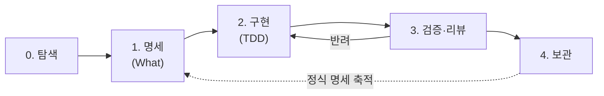

# 워크플로우 온보딩 — 팀에 오신 것을 환영합니다 👋

> [!abstract] 이 문서는
> 새로 합류한 당신이 **첫 변경을 끝까지(아이디어 → 동결된 명세 → TDD 구현 → 보관) 혼자 완주**할 수 있게 돕는 실전 가이드입니다. 통독 15분, 첫 한 바퀴를 직접 도는 데 반나절이면 충분합니다.
>
> 이 문서는 워크플로우 명세 [`Agentic-Coding-Workflow.md`](Agentic-Coding-Workflow.md)의 **파생 뷰**입니다 — 둘이 어긋나면 **명세 쪽이 이깁니다.** (그게 우리가 일하는 방식이기도 합니다 → §1)

---

## 1. 우리가 일하는 법 — 5분 요약

우리는 에이전트(AI)와 함께 코드를 씁니다. 에이전트는 빠르지만 **맥락을 잊습니다.** 세션이 끊기면(다른 날, 컨텍스트 리셋, 담당자 교대) "무엇을 만들기로 했지", "지금 어디까지 됐지"가 증발합니다. 그래서 우리는 **머릿속이 아니라 산출물로 일합니다.**

두 가지를 분리합니다.

| 축 | 질문 | 담당 도구 | 결과물 |
|---|---|---|---|
| **What — 무엇을** | 무엇을 만들 것인가 | **OpenSpec** | 동결된 명세 · 작업목록 |
| **How — 어떻게** | 어떻게 만들 것인가 | **Superpowers (TDD)** | RED→GREEN→REFACTOR 커밋 |

그리고 핵심 약속 두 가지:

- 🧭 **명세가 진실이다 (스펙 = SOT).** 동결된 OpenSpec 명세가 "무엇을"의 **유일한 진실원**입니다. 코드·테스트·기억이 명세와 다르면 **명세가 이깁니다.** 명세가 틀렸으면 코드가 아니라 **명세를 먼저 고칩니다.**
- 📦 **진행 상황판은 없습니다.** "지금 어디까지"는 따로 관리하는 보드가 아니라 **산출물에서 그대로 읽습니다** — 폴더 위치, `tasks.md` 체크, 커밋 이력. (왜? 보드를 두면 실제와 어긋나고, 그걸 맞추느라 시간을 쓰기 때문입니다.)

실제 코드를 만드는 에이전트(**런타임**)는 **Claude Code / Codex / Cursor 중 하나**를 골라 씁니다. 셋은 같은 입·출력(명세·작업목록·테스트)을 쓰므로, 무엇을 고르든 워크플로우는 동일합니다.

> [!tip] 한 문장으로
> **OpenSpec으로 "무엇을"을 동결하고, Superpowers의 TDD로 "어떻게"를 구현하며, 진행은 산출물에서 읽는다.** 이 한 줄을 이해하면 절반은 끝났습니다.

---

## 2. 꼭 외울 다섯 가지 (가드레일)

이 다섯 개만 몸에 배면 됩니다. 어기면 워크플로우가 멈춥니다.

1. **명세가 진실이다** — 코드가 명세와 다르면 명세에 맞춥니다. 명세가 틀렸으면 **명세를 먼저 고칩니다.**
2. **테스트부터** — 모든 코드는 실패하는 테스트(**RED**)에서 시작합니다. 테스트 없는 코드는 규칙 위반입니다.
3. **명세에 없으면 안 만든다** — `tasks.md`에 없는 작업은 하지 않습니다. 필요하면 명세부터(단계 1로).
4. **진행판을 만들지 마라** — 상태를 베껴 둔 보드를 만들지 않습니다. "어디까지"는 언제나 산출물에서 읽습니다.
5. **끝내기 전에 노트** — 세션을 마칠 땐 **핸드오프 노트**를, 비자명한 결정엔 **결정 노트**를 남깁니다.

> 전체 가드레일은 명세 [§7 거버넌스](Agentic-Coding-Workflow.md)에 있습니다.

---

## 3. 처음 한 번 — 셋업

설치는 한 번이면 됩니다. **OpenSpec(공통) → 런타임 하나(택1) → TDD 규율** 순으로 깔고, 프로젝트에서 `openspec init`(또는 `update`)을 돌리면 §5의 슬래시 커맨드까지 자동 설치됩니다.

> [!note] 사전 준비
> **Node.js 20.19+** 가 필요합니다(OpenSpec·Codex 공통). `node -v`로 확인하세요.

> [!tip] 한 방 셋업 — `bootstrap.sh`
> 아래 §3.1–§3.4를 한 번에 자동화한 스크립트입니다. 신규/기존 프로젝트는 `openspec/` 유무로 **자동 분기**(신규 → `openspec init` · 기존 → `openspec update`)합니다.
> - 신규(저장소 클론까지): `./bootstrap.sh --repo <팀 저장소> --runtime claude`
> - 기존(현재 폴더): `./bootstrap.sh --runtime codex --yes`
> - OpenSpec 설치 위치 선택: `./bootstrap.sh --openspec-scope project`(전역은 `global`, 기본값)
> - 실행 없이 계획만 보기: `./bootstrap.sh --dry-run`
>
> 옵션을 비우고 대화형으로 실행하면 **프로젝트 디렉터리**·**OpenSpec 설치 위치(전역/프로젝트)**·런타임을 직접 물어봅니다. Superpowers(대화형 설치)·Cursor(GUI 앱)는 스크립트가 **명령·링크만 안내**하니, 그 부분은 아래 §3.2·§3.3을 따르세요. 손으로 셋업하려면 아래 단계를 그대로 밟아도 됩니다.

### 3.1 OpenSpec 설치 (공통, 필수)

> 📖 공식 문서: [OpenSpec GitHub](https://github.com/Fission-AI/OpenSpec) · [설치·시작하기](https://github.com/Fission-AI/OpenSpec/blob/main/docs/getting-started.md) (전체 링크는 맨 아래 **더 읽기**)

```bash
npm install -g @fission-ai/openspec@latest   # 전역 설치 (기본; 프로젝트 설치는 아래 note)
git clone <팀 저장소> && cd <프로젝트>
```

> [!note] 전역 vs 프로젝트 설치
> 전역(`npm install -g`)이 기본 — 모든 프로젝트에서 `openspec`을 바로 씁니다. 전역 오염 없이 **버전을 프로젝트에 고정**하려면 프로젝트 로컬 설치도 됩니다: `npm install --save-dev @fission-ai/openspec@latest` 후 `npx openspec …`로 실행. 부트스트랩으로는 `./bootstrap.sh --openspec-scope project`(전역은 `--openspec-scope global`, 기본값)이며, 스크립트는 **기존 설치를 먼저 감지**해 있으면 그대로 씁니다. 어느 쪽이든 이후 `init`/`update`/`list`는 동일하게 동작합니다.

그다음 프로젝트 상태에 따라 한 번:

- 이미 `openspec/`가 있는 **기존 프로젝트** → `openspec update` (내 런타임의 슬래시 커맨드 설치·갱신)
- **새 프로젝트** → `openspec init` (`openspec/` 구조 생성 + 런타임별 커맨드 설치)

> `init`/`update`가 런타임을 물으면 §3.2에서 고른 것을 선택합니다. Codex 커맨드는 전역(`~/.codex/prompts/`)에 깔리므로, **Codex 사용자는 새 머신마다 한 번** 실행해야 합니다.

### 3.2 실행 런타임 하나 설치 (택1)

| 런타임 | 설치 | 실행 |
|---|---|---|
| **[Claude Code](https://code.claude.com/docs/en/overview)** | `npm install -g @anthropic-ai/claude-code` | `claude` |
| **[Codex](https://developers.openai.com/codex/)** | `npm install -g @openai/codex`  ·  또는 `brew install --cask codex` | `codex` |
| **[Cursor](https://cursor.com/docs)** | [cursor.com](https://cursor.com) 앱 다운로드 → 설치 후 `Cmd/Ctrl+Shift+P` → *Install 'cursor' command* | 앱 실행 |

> [!note] 런타임, 뭘 고를까?
> 정답은 없습니다. **팀이 쓰는 표준 하나**를 따르세요. 굳이 고른다면: 명세 작성·대규모 리팩터·다단계 추론은 *긴 맥락에 강한 것*, IDE 안 좁은 수정은 *에디터 통합형*, 반복 코드 생성은 *손에 익은 것*. 한 번 정하면 그걸로 일관되게 씁니다 — 매번 갈아타지 않습니다.

### 3.3 TDD 규율 설치·설정

구현(§4 단계 2)의 **RED→GREEN→REFACTOR**를 강제하는 장치입니다.

- **Claude Code → [Superpowers](https://github.com/obra/superpowers) 플러그인.** 활성 세션에서 `/plugin install superpowers@claude-plugins-official` 실행. (또는 `/plugin marketplace add obra/superpowers-marketplace` 후 `/plugin install superpowers@superpowers-marketplace`.) `/help`에 `/superpowers:brainstorm`이 보이면 성공.
- **Codex / Cursor → 프로젝트 규칙에 TDD 지침을 적어 둡니다.** Codex는 `AGENTS.md`, Cursor는 `.cursor/rules/`에 "모든 구현은 실패 테스트(RED)에서 시작한다" 등을 명시합니다(§5 참고).

### 3.4 마무리 확인

- [ ] `openspec list`가 동작한다 (OpenSpec 설치·init/update 완료; 프로젝트 설치면 `npx openspec list`)
- [ ] §5 표의 슬래시 커맨드가 내 런타임에 보인다 (`/opsx:propose` 등)
- [ ] (Claude Code) `/help`에 `/superpowers:*`가 보인다
- [ ] 노트 위치를 안다 — 각 change 폴더의 `notes.md`(결정·핸드오프)
- [ ] (선택) `make status` 같은 읽기 전용 진행 뷰 확인

---

## 4. 첫 변경 따라 하기 (Walkthrough)

예시로 **"할 일 항목에 마감일(due date) 추가"**라는 작은 기능을 0→4단계로 완주해 봅니다.



### 단계 0 — 탐색 🔍

```
/opsx:explore         # 아이디어·문제를 문답으로 탐색 (산출물 없음 · 도구별 트리거는 §5)
```

코드를 한 줄도 쓰지 않습니다. 목적은 **수렴**입니다.

- 에이전트와 문답하며 "왜 필요한가, 무엇을 만들 것인가"를 정리합니다.
- **통과 기준:** "무엇을 만들지"를 **한 문장**으로 말할 수 있다 → *"할 일 항목에 선택적 마감일 필드를 추가하고, 지난 항목을 강조 표시한다."*

### 단계 1 — 명세 ✍️ (What)

```
/opsx:propose         # 에이전트가 명세 초안을 작성 (도구별 트리거는 §5)
```

이때 생기는 것:

```
openspec/changes/add-due-date/
├── proposal.md      # 무엇을·왜
├── specs/           # 동작 명세(델타) — 요구사항은 EARS로 작성
├── tasks.md         # 검증 가능한 작업 목록
└── design.md        # (필요시) 설계 메모
```

`specs/`의 요구사항은 **EARS** 문법으로 씁니다 — 모호함을 줄이고, 각 요구사항을 곧장 테스트로 옮기기 위해서입니다.

```
# specs/ 안의 요구사항 예 (EARS)
- WHEN 사용자가 마감일을 입력하면, 시스템은 값을 ISO-8601로 저장해야 한다.
- IF 날짜 형식이 유효하지 않으면, THEN 시스템은 저장을 거부하고 오류를 알려야 한다.
- WHILE 마감일이 지난 동안, 시스템은 항목을 '지남'으로 표시해야 한다.
```

👉 패턴 전체는 §11 치트시트와 명세 [§8.1](Agentic-Coding-Workflow.md)에 있습니다.

- 에이전트가 초안을 쓰면 **당신(사람)이 읽고 동결(freeze)에 서명**합니다.
- **통과 기준:** 요구사항이 **EARS로** 쓰여 있고, `tasks.md`가 검증 가능한 단위로 쪼개져 있으며, 사람이 "이대로 만든다"고 동의했다.

> [!important] '동결'이 핵심입니다
> 동결 이후 "무엇을"이 바뀌면, 코드를 손대기 전에 **명세를 먼저 고칩니다.** 슬그머니 범위가 늘어나는 일(scope creep)을 *명세 변경*이라는 명시적 사건으로 끌어올리는 것 — 이게 우리 워크플로우의 가장 큰 안전장치입니다.

### 단계 2 — 구현 🧪 (How · TDD)

```
/opsx:apply           # tasks.md를 따라 구현 (도구별 트리거는 §5)
```

`apply`가 `tasks.md`의 항목을 위에서부터 하나씩 처리합니다. 그 위에 **RED → GREEN → REFACTOR** 규율이 얹힙니다(Superpowers/규칙 → §5):

```
각 task마다:
  1) RED      — 그 task를 표현하는 '실패하는 테스트'를 먼저 쓴다
  2) GREEN    — 테스트를 통과시키는 최소 코드만 쓴다
  3) REFACTOR — green을 유지하며 정리한다
  4) tasks.md의 해당 항목을 [x]로 바꾸고, 핸드오프 노트에 한 줄 남긴다
```

- 진행률은 따로 보고하지 않습니다 — **`tasks.md`의 체크 개수가 곧 진행률**입니다.
- **통과 기준:** 모든 task가 `[x]`, 로컬 테스트 전부 green.

> [!warning] 세션을 끊을 땐 반드시 핸드오프 노트
> 다음 사람(또는 내일의 당신)은 명세·작업목록·테스트·**핸드오프 노트**만 보고 이어받습니다. 머릿속 맥락에 의존하지 않습니다. 노트는 change 폴더의 `notes.md`에 남깁니다(템플릿 → §11).

### 단계 3 — 검증·리뷰 ✅

```
/opsx:verify          # 구현을 명세에 비춰 완전성·정확성·일관성 점검 (도구별 트리거는 §5)
```

- 로컬 테스트 green 확인 → 에이전트 셀프리뷰 → 사람 리뷰.
- 리뷰의 기준선은 취향이 아니라 **명세**입니다. "좋다/나쁘다"가 아니라 **"명세대로인가"**를 먼저 봅니다.
- 명세가 틀렸다면 그건 코드 반려가 아니라 **명세 개정**(단계 1로 복귀)입니다.
- **통과 기준:** 테스트 green, 리뷰 승인, 구현이 동결된 명세와 일치.

### 단계 4 — 보관 🗄️

```
/opsx:archive         # 델타 명세를 정식 specs/로 승격, change 폴더를 archive/로 이동
```

- 끝난 change는 `openspec/changes/archive/`로 이동합니다 = **완료의 표시**.
- 터미널에서 직접 하려면 CLI `openspec archive`도 같은 일을 합니다(§5).
- 승격된 명세가 누적되어 다음 탐색·명세의 토대가 됩니다.

🎉 한 바퀴 완주! 당신은 방금 아이디어를 동결된 명세로, 명세를 테스트 주도 구현으로, 구현을 정식 명세로 바꿨습니다 — 그리고 그 과정 전체가 산출물에 남았습니다.

---

## 5. 🛠 IDE별 단계 트리거

각 단계는 손으로 일일이 시키는 게 아니라, OpenSpec이 깔아 주는 **슬래시 커맨드**로 트리거합니다. 명령 ID(`opsx:*`)는 세 런타임이 **같고, 호출 표면만** 다릅니다. 처음 한 번 `openspec init`으로 쓰는 런타임을 고르면 아래 커맨드가 설치됩니다(갱신은 `openspec update`).

> 💡 `propose`·`apply`·`verify`처럼 **무언가를 생성·구현**하는 일은 AI 슬래시 커맨드로 트리거합니다. 반면 `openspec list`·`openspec validate`·`openspec archive`는 **CLI 명령**이라 어느 터미널에서든 직접 실행됩니다.

### 단계 × 런타임

| 단계 | 명령 ID | **Claude Code** | **Codex** | **Cursor** |
|---|---|---|---|---|
| 0 탐색 | `explore` | `/opsx:explore` | `/opsx-explore` | `/opsx-explore` |
| 1 명세 (What) | `propose` | `/opsx:propose` | `/opsx-propose` | `/opsx-propose` |
| 2 구현 (TDD) | `apply` | `/opsx:apply` | `/opsx-apply` | `/opsx-apply` |
| 3 검증·리뷰 | `verify` | `/opsx:verify` | `/opsx-verify` | `/opsx-verify` |
| 4 보관 | `archive` | `/opsx:archive` | `/opsx-archive` | `/opsx-archive` |

> Claude Code는 `:`(하위 폴더 네임스페이스), Codex·Cursor는 `-`(플랫 파일)를 씁니다 — 설치 경로가 달라서입니다(아래).

### 커맨드는 어디에 설치되나

| 런타임 | 설치 위치 | 범위 | 호출 |
|---|---|---|---|
| **Claude Code** | `.claude/commands/opsx/<id>.md` | 프로젝트 | 채팅 입력에 `/opsx:<id>` |
| **Cursor** | `.cursor/commands/opsx-<id>.md` | 프로젝트 | Agent/챗 입력에 `/opsx-<id>` |
| **Codex** | `~/.codex/prompts/opsx-<id>.md` (`$CODEX_HOME` 우선) | **전역**(모든 프로젝트) | 프롬프트에 `/opsx-<id>` |

### 알아 둘 것

- **단계 2의 TDD 규율은 별개다.** `apply`는 `tasks.md`를 따라 구현을 *진행*만 합니다. **RED→GREEN→REFACTOR**는 그 위에 얹힙니다 — Claude Code는 **Superpowers** 스킬이, Codex·Cursor는 프로젝트 규칙(`AGENTS.md` / `.cursor/rules/`)에 적어 둔 TDD 지침이 강제합니다.
- **단계적으로 만들고 싶으면:** `propose`(한 번에 전부) 대신 `/opsx:new` → `/opsx:continue`(산출물 하나씩 검토) 또는 `/opsx:ff`(한 번에). 멈춘 일 이어가기도 `/opsx:continue`.
- **공통 폴백 — 어느 도구든:** 슬래시 커맨드가 없거나 막히면, 통합 터미널에서 **`openspec` CLI를 직접** 돌리고(`openspec list` · `validate` · `archive`) 나머지는 자연어로 지시하세요. 산출물(폴더·`tasks.md`·커밋)이 인터페이스라 **무엇으로 트리거하든 결과는 같습니다**(명세 §6 실행 런타임, no lock-in).
- **구버전(classic) 설정**은 `/openspec:proposal · apply · archive` 형태일 수 있습니다 — 단계 매핑은 동일합니다.

---

## 6. ✅ 단계별 산출물 & 리뷰 게이트

각 단계는 **산출물 하나**를 남기고, 그 산출물을 **반드시 리뷰**한 뒤에야 다음으로 갑니다. 게이트는 방향이 있어 — **통과하지 못하면 다음 단계로 못 갑니다.** 리뷰의 잣대는 취향이 아니라 언제나 **동결된 명세(스펙=SOT)**입니다.

| 단계 | 산출물 | 반드시 리뷰할 것 (넘어가기 전) | 통과 게이트 |
|---|---|---|---|
| **0 탐색** | 문제 정의·후보 접근법·미해결 질문 (결정 노트) | "무엇을 만들지"가 **한 문장**으로 수렴됐는가 | 한 문장으로 말할 수 있다 (코드·명세 0) |
| **1 명세** | `changes/{slug}/`: `proposal.md` · `specs/`(EARS) · `tasks.md` · (`design.md`) | ① 요구사항이 **EARS로, 모호어 없이** ② `tasks.md`가 검증 단위(항목 1개 = RED 1개)로 분해 ③ proposal의 *무엇을/왜*가 탐색 결론과 일치 ④ (해당 시) **API 계약** 정의됨 | **사람의 동결 서명** — 없으면 코드 0줄 |
| **2 구현** | task별 RED→GREEN→REFACTOR 커밋 · `tasks.md` 체크 · 핸드오프 노트 | ① 테스트가 **먼저(RED)** 쓰였나 ② 구현이 그 task 명세에 **정확히** 대응(스코프 밖 추가 0) ③ 로컬 테스트 green | 모든 task `[x]` · 로컬 테스트 green |
| **3 검증·리뷰** | 테스트 결과(green) · 리뷰 코멘트 · (필요 시) 결정 노트 | ① 구현이 **동결 명세(EARS 항목 하나하나)와 일치** ② AC(수용 기준) 충족 ③ 테스트가 요구사항을 *실제로* 검증 — `/opsx:verify`로 완전성·정확성·일관성 점검 | 테스트 green + 리뷰 승인 + **명세 일치 확인** |
| **4 보관** | 정식 `openspec/specs/`로 승격된 명세 · `archive/`로 이동된 change | ① 델타 명세가 정식 specs에 **올바로 병합** ② change가 **진짜 완료**인가 (미완료를 archive하지 않는다) | `changes/archive/`에 폴더 존재 = 완료 |

> [!warning] 게이트를 건너뛰지 않는다
> - **가장 강한 두 게이트:** 단계 1의 **동결 서명**(없으면 구현 시작 불가)과 단계 3의 **명세 일치 확인**(없으면 보관 불가).
> - **반려는 사유와 함께.** 단계 3에서 막히면 단계 2로 되돌리고 **결정 노트에 왜**를 남깁니다. *명세 자체가 틀렸다면* 코드가 아니라 **명세를 고치러 단계 1로** 복귀합니다.
> - **리뷰 기준선은 언제나 명세.** "좋다/나쁘다"가 아니라 **"명세대로인가"**를 먼저 봅니다(§1, 스펙=SOT).

> [!note] 누가 리뷰하나
> 단계 1 **동결**은 *사람*이 명세를 읽고 서명합니다. 단계 2는 *에이전트 셀프리뷰*(매 task), 단계 3은 *에이전트 셀프리뷰 + 사람 리뷰*. 누가 보든 비추는 잣대는 하나 — **동결된 명세**입니다.

---

## 7. "그건 어디서 보나요?" — 진행 상황 읽기

진행 상황판이 없으니 신규 합류자가 가장 많이 묻는 질문입니다. 답은 **산출물에 질문하기**입니다.

| 궁금한 것 | 어디서 읽나 |
|---|---|
| 지금 진행 중인 변경은? | `openspec list` (또는 `openspec/changes/`의 archive 아닌 폴더) |
| 그 변경은 얼마나 됐나? | 해당 `tasks.md`의 `[x]` 비율 |
| 어떻게 여기까지 왔나? | 그 change의 커밋 이력 (`git log --oneline`) |
| 다음 할 일은? | `tasks.md`의 첫 미체크 항목 + 핸드오프 노트 |
| 무엇이 끝났나? | `openspec/changes/archive/` 안의 폴더들 |
| 왜 이렇게 결정했나? | 그 change의 **결정 노트** |

사람이 옮겨 적는 단계가 없으므로 **표류(drift)가 없습니다.** 이게 "진행판을 만들지 마라"의 진짜 이유입니다.

---

## 8. 자주 묻는 질문 (FAQ)

**Q. 칸반 보드나 진행 대시보드는 정말 없나요?**
없습니다. 위 §7처럼 산출물에서 읽습니다. 한눈에 보고 싶으면 `make status` 같은 *읽기 전용* 스크립트를 쓰되, 그건 상태를 **저장하지 않는 뷰**일 뿐입니다.

**Q. specs(명세)는 무슨 형식으로 쓰나요?**
**EARS** 패턴으로 씁니다 — `WHEN/WHILE/IF·THEN/WHERE` + "~해야 한다". 모호함을 줄이고 각 요구사항을 곧장 하나의 테스트로 옮기기 위해서입니다. 패턴 표는 §11 치트시트에 있습니다.

**Q. 테스트부터 쓰는 게 느리게 느껴져요.**
RED 먼저는 협상 대상이 아니라 규율입니다. 실패하는 테스트가 곧 "이 코드가 무엇을 해야 하는가"의 실행 가능한 정의입니다 — 다음 세션이 그걸 보고 이어받습니다.

**Q. 구현하다 보니 명세가 틀렸어요.**
좋은 발견입니다. 코드를 우회로 고치지 말고 **명세를 먼저 고치세요**(단계 1로 복귀). 명세가 항상 이깁니다.

**Q. 작업 범위가 도중에 커졌어요.**
조용히 늘리지 마세요. 그건 **명세 변경 사건**입니다 — 새 change를 만들거나 현재 change를 개정합니다.

**Q. 세션이 끝났는데 다음 사람이 어떻게 이어받나요?**
`notes.md`의 **핸드오프 노트** 한 줄("다음 할 일 + 마지막 green 커밋 해시")이면 됩니다. 머릿속 맥락에 기대지 않습니다.

**Q. 런타임을 바꿔도 되나요?**
됩니다 — 인터페이스가 산출물로 고정돼 있어 손실 없이 갈아탈 수 있습니다. 다만 "필요하면 교체"이지 "여러 개를 동시에 병행"은 아닙니다.

---

## 9. 당신의 첫 주 — 체크리스트

**Day 0 — 셋업 (§3)**
- [ ] 저장소 클론, `openspec/` 구조 확인
- [ ] 실행 런타임 하나 선택
- [ ] 노트 위치(`notes.md`) 확인

**Day 1 — 관찰**
- [ ] 최근 `archive/`된 change 하나를 열어 `proposal.md → tasks.md → 커밋`을 따라 읽기
- [ ] `openspec list`로 현재 진행 중인 변경 둘러보기
- [ ] §2의 가드레일 다섯 가지 읽기

**Day 2–3 — 첫 변경**
- [ ] 아주 작은 change 하나를 0→4단계로 완주
- [ ] 핸드오프 노트 한 줄 남겨 보기
- [ ] 검증 단계에서 "명세대로인가"로 셀프리뷰

**첫 주 끝 — 자가 점검**
- [ ] 가드레일 다섯 가지를 보지 않고 말할 수 있다
- [ ] "지금 어디까지 왔나"를 산출물만 보고 30초 안에 답할 수 있다

---

## 10. 막혔을 때

1. **명세를 다시 읽으세요.** 대부분의 "어떻게 하지?"는 명세가 이미 답합니다(스펙 = SOT).
2. **`tasks.md`의 첫 미체크 항목**을 보세요. 다음 할 일은 거의 항상 거기 있습니다.
3. **결정 노트**를 찾아보세요. "왜 이렇게 했지?"의 답이 코드가 아니라 노트에 있습니다.
4. 그래도 막히면 팀에 물어보고, **결론을 결정 노트로 남기세요** — 다음 사람이 같은 데서 막히지 않도록.

---

## 11. 치트시트

### 명령어

**단계 트리거** — 런타임 채팅에 입력 (전체 표 → §5)

```
/opsx:propose     # 1. 명세 초안 생성 (changes/{slug}/)
/opsx:apply       # 2. tasks.md 따라 구현
/opsx:verify      # 3. 완전성·정확성·일관성 점검
/opsx:archive     # 4. 완료 change 보관 (정식 specs/ 승격)
```

**CLI 유틸리티** — 어느 터미널에서나

```bash
openspec list                          # 진행 중 / 보관된 change 보기
openspec validate                      # 명세·변경 구조 검증
openspec archive                       # 보관을 터미널에서 직접 (= /opsx:archive)
cat openspec/changes/<slug>/tasks.md   # 진행률 = [x] 비율
git log --oneline <범위>               # 어떻게 왔는지 (RED/GREEN/REFACTOR)
make status                            # (있다면) 진행 한눈에 — 읽기 전용 뷰
```

### EARS 요구사항 패턴 (specs 작성)

| 패턴 | 형식 |
|---|---|
| 상시 | `<시스템>은 <응답>해야 한다.` |
| 이벤트 | `WHEN <트리거>, <시스템>은 <응답>해야 한다.` |
| 상태 | `WHILE <상태>, <시스템>은 <응답>해야 한다.` |
| 예외 | `IF <원치 않는 조건>, THEN <시스템>은 <응답>해야 한다.` |
| 선택 기능 | `WHERE <기능 포함 시>, <시스템>은 <응답>해야 한다.` |
| 조합 | `WHILE <상태>, WHEN <트리거>, <시스템>은 <응답>해야 한다.` |

### 핸드오프 노트 (세션 끝에)

```
[Handoff] 2026-06-18 · codex
- 한 일:   task 3까지 완료 (RED→GREEN→REFACTOR)
- 마지막 green 커밋: a1b2c3d
- 다음:    task 4 마감일 검증 — 기존 테스트 todo_test::test_due 확장부터
- 막힌 점: 없음
```

### 결정 노트 (비자명한 선택을 했을 때)

```
[Decision] 마감일 저장 형식
- 맥락:   무엇을 정해야 했나
- 선택지: A 날짜만 / B 날짜+시간
- 결정·근거: A를 택함, 이유 …
- 영향:   바뀌는 것 / 되돌리는 비용
```

### 용어집

| 용어 | 뜻 |
|---|---|
| **What / How** | 무엇을(OpenSpec) / 어떻게(Superpowers TDD) |
| **SOT** | Single Source of Truth(유일한 진실원). 우리에겐 **동결된 OpenSpec 명세** |
| **[EARS](https://alistairmavin.com/ears/)** | Easy Approach to Requirements Syntax. 요구사항을 `WHEN/WHILE/IF·THEN/WHERE` + "~해야 한다" 패턴으로 쓰는 문법 → 모호함↓·테스트화↑ |
| **동결(freeze)** | 사람이 명세를 읽고 "이대로 만든다"고 서명. 이후 변경은 *명세 개정 사건* |
| **change** | 하나의 변경 단위 = `openspec/changes/{slug}/` 폴더 |
| **RED→GREEN→REFACTOR** | 실패 테스트 → 통과 최소 구현 → 정리 |
| **archive** | 완료 change를 정식 명세로 승격하고 `changes/archive/`로 이동 |
| **핸드오프 노트** | 세션 끝에 "다음 할 일 + 마지막 green 커밋"을 남기는 글 |
| **결정 노트** | 코드에 안 남는 *왜*를 남기는 글 |
| **런타임** | 실제 코드를 생성하는 에이전트(Claude Code / Codex / Cursor 중 택1) |

---

## 더 읽기

이 워크플로우가 기대는 도구·개념의 **공식 출처**입니다. 막히거나 더 깊이 알고 싶을 때 원본을 보세요.

**이 워크플로우 (원본 명세)**
- 📜 [`Agentic-Coding-Workflow.md`](Agentic-Coding-Workflow.md) — 워크플로우 **명세 원본**(이 온보딩의 SOT). 단계별 입력/산출물/게이트, 정보 흐름, 거버넌스 전문이 여기 있습니다.

**핵심 도구 — What & How (§1)**
- 📐 **OpenSpec** (What) — [GitHub](https://github.com/Fission-AI/OpenSpec) · [설치·시작하기](https://github.com/Fission-AI/OpenSpec/blob/main/docs/getting-started.md) · [`/opsx` 슬래시 워크플로우](https://github.com/Fission-AI/OpenSpec/blob/main/docs/opsx.md) · [CLI 레퍼런스](https://github.com/Fission-AI/OpenSpec/blob/main/docs/cli.md)
- 🧪 **Superpowers** (How·TDD) — [프레임워크 GitHub](https://github.com/obra/superpowers) · [플러그인 마켓플레이스](https://github.com/obra/superpowers-marketplace)

**실행 런타임 — 택1 (§3.2)**
- 🤖 **Claude Code** — [공식 문서](https://code.claude.com/docs/en/overview)
- 🤖 **Codex** — [GitHub](https://github.com/openai/codex) · [개발자 문서](https://developers.openai.com/codex/)
- 🤖 **Cursor** — [문서](https://cursor.com/docs) · [다운로드](https://cursor.com)

**개념·규약**
- 📏 **EARS** (요구사항 문법 → §11 치트시트) — [Alistair Mavin 공식 가이드](https://alistairmavin.com/ears/) · [Wikipedia](https://en.wikipedia.org/wiki/Easy_Approach_to_Requirements_Syntax)

> [!quote] 우리가 지키려는 한 가지
> 사람이 코드를 일일이 읽지 않고도 **"무엇을 만들기로 했고(What), 어떻게 만들어지고 있는지(How)"**를 30초 안에 답할 수 있게 한다. "지금 어디까지 왔나"는 따로 묻지 않는다 — **산출물이 곧 답이다.**
