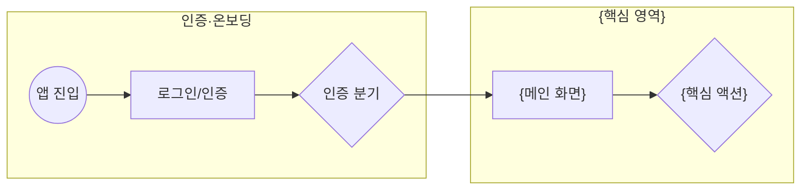

# 유저플로우 템플릿 (3단계)

`planning/{slug}/userflow.md`로 저장. **Mermaid `flowchart` + 영역별 `subgraph`** (Manny 라이브 산출물 기준).

## 구조 규칙

- **영역(subgraph) = 기능명세서의 요구사항 묶음 또는 화면 영역.** 예: 인증·온보딩 / 세션 관리 / 메인 작업화면 / 설정 / 관리자.
- **노드 모양으로 종류 구분:**
  - `(("앱 진입"))` — 시작점(원)
  - `["화면/페이지"]` — 화면·상태(사각)
  - `{"분기/액션"}` — 사용자 액션·조건 분기(마름모)
- **모든 화면/액션은 기능명세서의 기능과 대응**되어야 한다. 유저플로우에만 있고 기능명세에 없는 화면 = 불일치 → 둘 중 하나를 고친다.
- 노드 id는 `n1, n2, …`로 짧게, 라벨은 한국어로.

## 템플릿

````markdown
# {제품명} — 유저플로우

> 기능명세서: planning/{slug}/feature-spec.md (상류)


````

## 단일 페이지 / 패널형 UI 표현

화면 전환이 아니라 **한 페이지 안에서 패널·탭으로 이동**하는 제품이면(예: Manny의 "코크핏 단일 페이지 워크스페이스"),
페이지 이동 화살표가 아니라 **패널 포커스/내용 교체**로 표현한다:

```
n13["메인 워크스페이스"] --> n14["터미널 패널"]
n14 --> n22{"파일 경로 클릭→파일패널"}
n22 --> n16["파일 뷰어 패널"]
```

별도 페이지로 분리하지 말고, 한 메인 노드 아래 패널 노드들이 매달리는 형태로 그린다.

## 검증·게이트

- Mermaid 문법이 유효한가 (렌더링되는가).
- 기능명세서의 모든 주요 기능이 플로우 어딘가에 등장하는가.
- 막다른 노드(들어오기만 하고 나가지 않는 비종료 노드)가 없는가.
- 사용자 확인 후 4단계.
